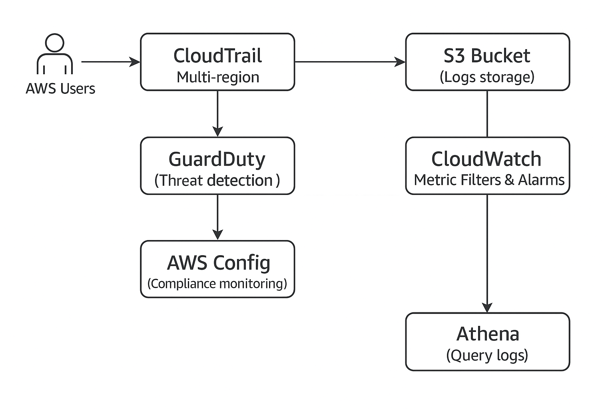

## AWS Logging & Monitoring Lab

Implemented proactive threat detection and compliance monitoring across AWS services using CloudTrail, GuardDuty, AWS Config, CloudWatch and Athena for log analysis.

---

## Table of Contents

- [Overview](#overview)
- [Real-World Risk](#real-world-risk)
- [What I Built](#what-i-built)
- [Diagram](#diagram)
- [Objectives](#objectives)
- [Steps Performed](#steps-performed)
  - [1. CloudTrail Setup]
  - [2. GuardDuty Enablement]
  - [3. AWS Config Setup]
  - [4. CloudWatch Metric Filter & Alarm]
  - [5. Athena Query Setup]
  - [6. Cleanup]
- [Screenshots](#screenshots)
- [JSONs Table](#jsons-table)
- [Lessons Learned](#lessons-learned)
- [References](#references)
- [Contact](#contact)

---

## Overview

This lab focused on implementing centralized security logging, threat detection, and configuration compliance monitoring in AWS. Using CloudTrail for API auditing, GuardDuty for threat detection, AWS Config for resource compliance, CloudWatch for alerting, and Athena for querying logs, the lab demonstrates an end-to-end logging and monitoring pipeline essential for security operations.

---

## Real-World Risk

In modern cloud environments, the sheer volume of API activity and complex configurations can obscure malicious behavior or compliance drift, increasing the risk of unnoticed breaches and misconfigurations. Without centralized logging, threat detection and continuous compliance monitoring, attackers can exploit gaps in visibility to move laterally, exfiltrate data or persist undetected. This lab addresses these risks by implementing a comprehensive logging and monitoring solution that enables proactive detection of suspicious activities and ensures that cloud resources remain securely configured.

---

## What I Built

- Multi-region AWS CloudTrail trail to capture all API calls and user activity.
- Enabled GuardDuty for continuous threat detection using machine learning and threat intelligence.
- Configured AWS Config with multiple managed rules to monitor resource compliance against security best practices.
- Created CloudWatch metric filters and alarms to detect and alert on critical events such as unauthorized console logins.
- Set up Athena to query CloudTrail logs stored in S3 for detailed forensic analysis and incident investigation.
- Secured log storage and alerting mechanisms to ensure integrity and timeliness of security data.

---

## Diagram

---

## Objectives

- Enable CloudTrail to log all API activity across regions into S3.
- Enable GuardDuty threat detection.
- Set up AWS Config with managed rules for security compliance.
- Configure CloudWatch metric filters and alarms for security events.
- Use Athena to query CloudTrail logs for audit and investigation.

---

## Steps Performed

**1. CloudTrail Setup**
   - Created a multi-region CloudTrail trail named main-trail to capture all API activity.
   - Configured the trail to deliver logs to a dedicated S3 bucket (my-cloudtrail-logs-sebastiansilva)
   - Verified CloudTrail logging via console and confirmed logs in the S3 bucket *(Screenshot: cloudtrail_trail_summary.png)*

**2. GuardDuty Enablement**
   - Enabled GuardDuty for threat detection in the main AWS region.
   - Verified GuardDuty status in the console *(Screenshot: guardduty_enabled_dashboard.png)*

**3. AWS Config Setup**
   - Enabled AWS Config to record all supported resource types.
   - Applied multiple AWS managed rules to enforce security compliance, including password policies and public access restrictions.
   - Verified compliance dashboard status *(Screenshot: awsconfig_rules_compliance_status.png)*

**4. CloudWatch Metric Filter & Alarm**
   - Created a CloudWatch metric filter to detect ConsoleLogin events from CloudTrail logs.
   - Configured a CloudWatch alarm triggered on login activity for real-time alerting.
   - Captured metric filter and alarm summaries *(Screenshots: cloudwatch_metric_filter_consolelogin.png & cloudwatch_alarm_consolelogin_summary.png)*

**5. Athena Query Setup**
   - Configured Athena query output bucket in S3.
   - Created Athena table from CloudTrail logs stored in S3.
   - Executed SQL queries to analyze recent login events and API activities.
   - Captured Athena query results *(Screenshot: sample-cloudtrail-log-json.png)*

**6. Cleanup**
   - Deleted CloudTrail trails and emptied S3 buckets storing CloudTrail logs.
   - Disabled GuardDuty and removed associated data.
   - Deleted AWS Config rules, stopped and removed configuration recorder and delivery channels.
   - Removed CloudWatch log groups, metric filters and alarms created during the lab.
   - Dropped Athena tables and emptied/deleted the S3 bucket used for Athena query results.
   - Cleaned up IAM roles, policies, and any other temporary resources created for lab purposes.
   
---

## Screenshots

*All screenshots are included in the screenshots/ folder of this repository.*

| Order | File Name                                 | What it Shows                                      |
|-------|-------------------------------------------|----------------------------------------------------|
| 1     | awsconfig_rules_compliance_status.png     | AWS Config dashboard showing compliance status     |
| 2     | cloudtrail_trail_summary.png              | Multi-region CloudTrail trail summary              |
| 3     | cloudwatch_alarm_consolelogin_summary.png | CloudWatch alarm summary for ConsoleLogin events   |
| 4     | cloudwatch_metric_filter_consolelogin.png | CloudWatch metric filter for ConsoleLogin events   |
| 5     | guardduty_enabled_dashboard.png           | GuardDuty dashboard showing enabled status         |
| 6     | sample-cloudtrail-log-json.png            | Sample raw CloudTrail event JSON log for reference |

---

## JSONs Table

*JSON files are included in the /sample_jsons/ folder for reference in this repository.

| Order | File Name                               | What it Shows                                |
|-------|-----------------------------------------|----------------------------------------------|
| 1     | awsconfig_rule_noncompliant_sample.json | AWS Config non-compliance finding JSON       |
| 2     | cloudtrail_event_sample.json            | Sample CloudTrail event JSON                 |
| 3     | guardduty_sample_finding.json           | Sample GuardDuty finding JSON                |

---

## Lessons Learned

- Centralized logging with CloudTrail is essential for tracking all AWS API activity and forensic analysis.
- GuardDuty enhances security posture with automated threat detection powered by machine learning.
- AWS Config enables continuous compliance monitoring with customizable rules that detect misconfigurations.
- CloudWatch metric filters and alarms provide real-time alerting on suspicious activity.
- Athena enables flexible, fast querying of raw logs stored in S3, empowering security investigations and audits.

---

## References

- [AWS CloudTrail Documentation](https://docs.aws.amazon.com/awscloudtrail/latest/userguide/cloudtrail-user-guide.html)
- [AWS GuardDuty Documentation](https://docs.aws.amazon.com/guardduty/latest/ug/what-is-guardduty.html)
- [AWS Config Documentation](https://docs.aws.amazon.com/config/latest/developerguide/WhatIsConfig.html)
- [AWS CloudWatch Documentation](https://docs.aws.amazon.com/AmazonCloudWatch/latest/monitoring/WhatIsCloudWatch.html)
- [AWS Athena Documentation](https://docs.aws.amazon.com/athena/latest/ug/what-is.html)

---

## Contact

Sebastian Silva C. – July, 2025 – Berlin, Germany.  
[LinkedIn](https://www.linkedin.com/in/sebastiansilc) | [GitHub](https://github.com/SebaSilC) | [sebastian@playbookvisualarts.com](mailto:sebastian@playbookvisualarts.com)
